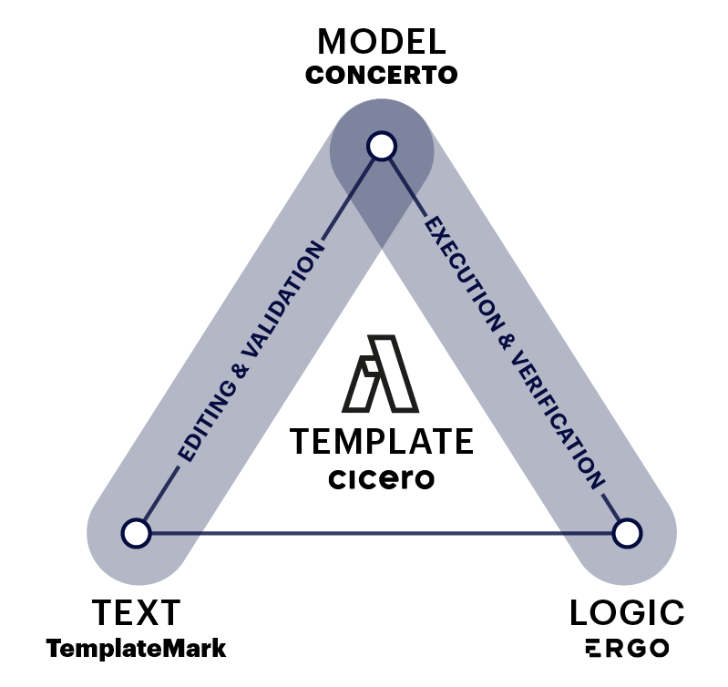

## What is a Template?

A template ties legal text to computer code. It is composed of three elements:

- **Template Text**: the natural language of the template
- **Template Model**: the data model that backs the template, acting as a bridge between the text and the logic
- **Template Logic**: the executable business logic for the template



The three components (Text - Model - Logic) can also be intuitively understood as a **progression**, from _human-readable_ legal text to _machine-readable_ code. When combined these three elements allow templates to be edited, validated, verified, and then executed on any computer platform (on your own machine, on a Cloud platform, on Blockchain, etc).

> Note that the computing term 'execution' is used here, which means run by a computer. This is distinct from the legal term 'execution', which usually refers to the process of signing an agreement.

### Cicero

The main software implementation for the Accord Project is called [Cicero](https://github.com/accordproject/cicero). It defines the structure of natural language templates, bound to a data model, that can be executed using request/response JSON messages. By doing this, Cicero allows users to create and manipulate software templates which tie together all three components in the template triangle (i.e., the text, model and logic).

_More information about how to install Cicero and get started with Accord Project templates can be found in the [Installation](started-installation) Section of this documentation._

## Template Text


The template text is the natural language of the clause or contract. It can include markup to indicate [variables](ref-glossary#variable) for that template. Both the model, which reflects the data referred to in the text, and the logic, which reflects the business logic in the text, will be explained in future sections.

The following shows the text of an **Acceptance of Delivery** clause.

```tem
## Acceptance of Delivery.

{{shipper}} will be deemed to have completed its delivery obligations
if in {{receiver}}'s opinion, the {{deliverable}} satisfies the
Acceptance Criteria, and {{receiver}} notifies {{shipper}} in writing
that it is accepting the {{deliverable}}.

## Inspection and Notice.

{{receiver}} will have {{businessDays}} Business Days to inspect and
evaluate the {{deliverable}} on the delivery date before notifying
{{shipper}} that it is either accepting or rejecting the
{{deliverable}}.

## Acceptance Criteria.

The 'Acceptance Criteria' are the specifications the {{deliverable}}
must meet for the {{shipper}} to comply with its requirements and
obligations under this agreement, detailed in {{attachment}}, attached
to this agreement.
```

The text is written in plain English, with variables between `{{` and `}}` and highlighted in blue. Using variables is useful so the same template can be used in different agreements by replacing them with different values.

For instance, the following show the same **Acceptance of Delivery** clause where the `shipper` is `"Party A"`, the `receiver` is `"Party B"`, the `deliverable` is `"Widgets"`, etc.

```md
## Acceptance of Delivery.

"Party A" will be deemed to have completed its delivery obligations
if in "Party B"'s opinion, the "Widgets" satisfies the
Acceptance Criteria, and "Party B" notifies "Party A" in writing
that it is accepting the "Widgets".

## Inspection and Notice.

"Party B" will have 10 Business Days to inspect and
evaluate the "Widgets" on the delivery date before notifying
"Party A" that it is either accepting or rejecting the
"Widgets".

## Acceptance Criteria.

The "Acceptance Criteria" are the specifications the "Widgets"
must meet for the "Party A" to comply with its requirements and
obligations under this agreement, detailed in "Attachment X", attached
to this agreement.
```

### CiceroMark

CiceroMark is the markup format in which the text for Accord Project compliant templates is written. It defines notations (such as the `{{` and `}}` notation for variables used in the **Acceptance of Delivery** clause) which allows a computer to make sense of your templates.

It also provides the ability to specify the document structure (e.g., headings, lists), to highlight certain terms (e.g., in bold or italics), to indicate text which is optional in the agreement, and more.

_More information about the Accord Project markup can be found in the [CiceroMark](markup-cicero) Section of this documentation._

## Template Model


Unlike a standard document template (e.g., in Word or pdf), Accord Project templates associate a _model_ to the natural language text. The model acts as a bridge between the text and logic; it gives the users an overview of the components, as well as the traits of different components.

The model lets you categorize variables (is it a number, a monetary amount, a date, a reference to a business or organization, etc.). This model is crucial, because it allows the computer to make sense of the information contained in your template.

The following shows the model for the **Acceptance of Delivery** clause.

```ergo
/* The template model */
asset AcceptanceOfDeliveryClause extends AccordClause {

  /* the shipper of the goods*/
  --> Organization shipper

  /* the receiver of the goods */
  --> Organization receiver

  /* what we are delivering */
  o String deliverable

  /* how long does the receiver have to inspect the goods */
  o Integer businessDays

  /* additional information */
  o String attachment
}
```

Thanks to the model, the computer now knows that the `shipper` variable (`"Party A"` in the example) and the `receiver` variable (`"Party B"` in the example) are both `Organization` types. The computer also knows that variable `businessDays` (`10` in the example) is an `Integer` type; and that the variable `deliverable` (`"Widgets"` in the example) is a `String` type, and can contain any text description.

> If you are unfamiliar with the different types of variables, or want a more thorough explanation of what variables are, please refer to our [Glossary](ref-glossary#data-models) for a more detailed explanation.

### Concerto

Concerto is the modeling language which is used to describe the information used in Accord Project templates. Concerto offers modern modeling capabilities including support for nested or optional data structures, enumerations, relationships, object-oriented style inheritance, and more.

_More information about Concerto can be found in the [Concerto Modeling](model-concerto) section of this documentation._

## Template Logic


While the combination of text and model already sets Accord Project templates apart from a more traditional document format, the logic is what allows templates to really _come alive_. The logic allows a developer to associate _behavior_ to the template (specify what happens when a delivery is received late, check conditions for payment, automate interest rate calculations, determine if there has been a breach of contract, etc).

The following shows the logic for the **Acceptance of Delivery** clause.

```ergo
contract AcceptanceOfDelivery over AcceptanceOfDeliveryClause {
  clause acceptanceofdelivery(request : InspectDeliverable) : InspectionResponse {

		let received = request.deliverableReceivedAt;
    enforce isBefore(received,now()) else
      throw ErgoErrorResponse{ message : "Transaction time is before the deliverable date." }
    ;

    let status =
      if isAfter(now(), addDuration(received, Duration{ amount: contract.businessDays, unit: ~org.accordproject.time.TemporalUnit.days}))
      then OUTSIDE_INSPECTION_PERIOD
      else if request.inspectionPassed
      then PASSED_TESTING
      else FAILED_TESTING
    ;
    return InspectionResponse{
      status : status,
      shipper : contract.shipper,  
      receiver : contract.receiver
    }
  }
}
```

The logic specifies what conditions should be met for a delivery to be accepted. The code checks whether delivery has already been made; whether the acceptance is timely, within the specified inspection date; and whether the inspection has passed or not.

### Ergo

Ergo is the programming language which is used to capture the contractual logic in templates. Ergo is specifically designed for legal agreements, and is intended to be accessible for those creating the corresponding prose for those computable legal contracts. Ergo expressions can be embedded in the marked-up text for a template.

_More information about Ergo can be found in the [Ergo Logic](logic-ergo) Section of this documentation._

## What next?

Try building smart legal contract templates for yourself, either [online](tutorial-latedelivery), using Template Studio, or by [installing Cicero](started-installation).

Find links to [sample templates](started-resources) and other resources in the rest of this documentation.

If there were technical words that you were not familiar with, please refer to our [Glossary](ref-glossary) for a more detailed explanation.
