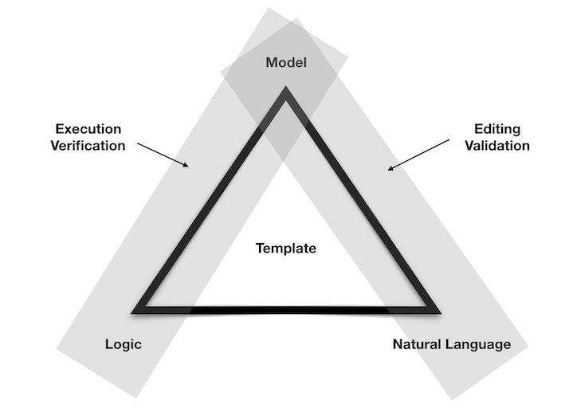

## What is Accord Project?

Accord Project is an open source, non-profit, initiative working to transform contract management and contract automation by digitizing contracts. 

The Accord Project provides an open, industry-driven, specification and implementation for _smart legal contracts_. Participants include some of the leading law firms and blockchain technology organizations in the world.

For more information about the Accord Project as a whole (how to join, upcoming meetings, latest news, open source process, etc) please visit the main [Accord Project Web Site](https:www.accordproject.org).

## What is an Accord Project Template?

An Accord Project template is composed of three elements: 

- Natural Language, the grammar for the legal text of the template
- Model, the data model that backs the template 
- Logic, the executable business logic for the template

When combined these three elements allow templates to be edited, analyzed, queried and executed.

## Technology

The Accord Project provides a complete solution for smart legal contract development. The main project for the Accord Project technology is called [Cicero](https://github.com/accordproject/cicero).

### Cicero

Cicero implements a format for legal contract and clause templates based on the [Accord Project Template Specification](accordproject-specification).

Cicero relies on two other projects:
- [Concerto](https://github.com/hyperledger/composer-concerto): a lightweight, reusable data modeling language (maintained by the Hyperledger forum)
- [Ergo](https://github.com/accordproject/ergo): a domain specific language to express the executable logic of legal templates

### Concerto

### Ergo

Ergo is a domain-specific language (DSL) that captures the execution logic of *legal* contracts. 

A DSL is a computer language that's targeted to a particular kind of problem, rather than a general-purpose language that's aimed at any kind of software problem. For example, HTML is a DSL targeted at developing web pages. Similarly, Ergo is a DSL that captures the execution logic of legal contracts.

It is important that a developer and a lawyer can together agree that clauses in a computable legal contract have the same semantics as the equivalent Ergo code. For that reason, Ergo is intended to be accessible to Lawyers who create the corresponding prose for computable legal contracts. As a programming language, the Ergo syntax also respects programming conventions.

## Ecosystem

Beyond those core projects, Accord Project is building a rich ecosystem which includes community-contributed content based on that technology:

- [Model Repository](https://models.accordproject.org/) : a repository of open source data models for use in Cicero templates and with Ergo logic
- [Template Library](https://templates.accordproject.org/) : a library of open source templates for various legal domains (supply-chain, loans, intellectual property, etc.)

as well as tools to help author new legal templates:

- [Template Studio](https://studio.accordproject.org/): a Web-based editor for Accord Project templates
- [VSCode Plugin](https://marketplace.visualstudio.com/items?itemName=accordproject.accordproject-vscode-plugin): an Accord Project extension to the popular [Visual Studio Code](https://visualstudio.microsoft.com/)

## Open Source Community

The Accord Project technology is being developed as open source. All the software packages are being actively maintained on [GitHub](https://github.com/accordproject) and we encourage organizations and individuals to contribute requirements, documentation, issues, new templates, and code.

Join the Accord Project Technology Working Group <a href="https://docs.google.com/forms/d/e/1FAIpQLScmPLO6vflTKFTRTJXiopCjGEvS5mMeH-ZlBnuStiQ3U4k19A/viewform">Slack channel</a> to get involved!

## Try Accord Project Online

The simplest way to get an introduction to the Accord Project technology is through the online [Template Studio](https://studio.accordproject.org) editor (you can open template studio from anywhere in this documentation by clicking the [Try Online!](https://studio.accordproject.org) button located in the top-right menu).

The following video provides a tour of Template Studio and illustrates the key concepts behind the Accord Project technology.

<iframe src="https://player.vimeo.com/video/328933628" width="640" height="400" frameborder="0" allow="autoplay; fullscreen" allowfullscreen></iframe>

## Local Installation

If you want to experience the full power of Accord Project, you should install the Cicero command-line tools on your own machine.

