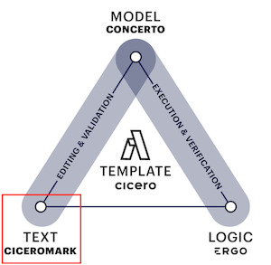

## What is Accord Project?

Accord Project is an open source, non-profit, initiative aimed at transforming contract management and contract automation by digitizing contracts.

Accord Project defines a notion of legal template with associated computing logic which is expressive, open-source, and portable. 

Accord project templates are similar to a clause or contract template in any document format, but they can be read, interpreted, and run by a computer.

## What is an Accord Project Template?

An Accord Project template ties legal text (for a clause or contract) to computer code. It is composed of three elements: 

- **The Template Text**: the natural language of the template
- **The Template Model**: the data model that backs the template 
- **The Template Logic**: the executable business logic for the template


When combined these three elements allow templates to be edited, validated, verified, and then executed on any computer platform (on your own machine, on a Cloud platform, on Blockchain, etc).

> Note that we use the computing term 'execution' here, which means run by a computer. This is distinct from the legal term 'execution' which usually refers to the process of signing an agreement.

### Cicero

The main software implementation for the Accord Project is called [Cicero](https://github.com/accordproject/cicero). It allows users of the accord project to create and manipulate software templates which tie together all three components in the triangle above (i.e., the text, model and logic).

_More information about how to install Cicero and get started with Accord project templates can be found in the [Installation](accordproject-installation) Section of this documentation._

## Template Text



The template text is the natural language of the clause or contract. It can include markup to indicate variables (or parameters) for that template.

The following screenshot shows the text of an acceptance of delivery clause.


The text is written in plain English with variables between `{{` and `}}` and highlighted in blue. Using variables is useful so the same template can be used in different agreements by replacing them by different values.

For instance, the following show the same acceptance of delivery clause where the `shipper` is `"Party A"`, the `receiver` is `"Party B"`, the `deliverable` is `"Widgets"`, etc.

```md
Acceptance of Delivery. "Party A" will be deemed to have completed its
delivery obligations if in "Party B"'s opinion, the "Widgets"
satisfies the Acceptance Criteria, and "Party B" notifies "Party A" in
writing that it is accepting the "Widgets".


Inspection and Notice. "Party B" will have 10 Business Days' to
inspect and evaluate the "Widgets" on the delivery date before
notifying "Party A" that it is either accepting or rejecting the
"Widgets".

Acceptance Criteria. The "Acceptance Criteria" are the specifications
the "Widgets" must meet for the "Party A" to comply with its
requirements and obligations under this agreement, detailed in
"Attachment X", attached to this agreement.
```

### CiceroMark

CiceroMark is the markup format in which the text for Accord Project templates is written. It defines notations (such as the `{{` and `}}` notation for variables that we saw in the acceptance of delivery clause above) which allows a computer to make sense of your templates.

It also provides the ability to specify the document structure (e.g., headings, lists), to highlight certain terms (e.g., in bold or italics), to indicate text which is optional in the agreement, and more.

_More information about the Accord Project markup can be found in the [CiceroMark](markup-cicero) Section of this documentation._

## Template Model


Compared to a standard document template (e.g., in Word or pdf), Accord Project templates associate a _model_ to the natural language text. The model lets you categorize variables (is it a number, a monetary amount, a date, a reference to a business or organization, etc.). This model is crucial in that it allows the computer to make sense of the information contained in your template.

The following screenshot shows the model for the acceptance of delivery clause above.


Thanks to that model, the computer now knows that the `shipper` variable (`"Party A"` in the example above) contains a reference to an `Organization`, that variable `receiver` (`"Party B"` in the example above) also contains a reference to an Organization, that variable `deliverable` (`"Widgets"` in the example above) can contain any text description, etc.

### Concerto

Concerto is the modeling language which is used to describe the information used in Accord Project templates. Concerto offers modern modeling capabilities including support: for nested or optional data structures, enumerations, relationships, object-oriented style inheritance, and more.

_More information about Concerto can be found in the [Concerto Modeling](model-concerto) Section of this documentation._

## Template Logic


While the combination of text and model already sets Accord Project template apart from a more traditional document format, the logic is what allows templates to really _come alive_. The logic allows a developer to associate _behavior_ to the template (specify what happens when a delivery is received late, check conditions for payment, automate interest rate calculations, determine if there has been a breach of contract, etc).

The following screenshot shows the logic for the acceptance of delivery clause above.


That logic specify what conditions should be met for a delivery to be accepted (checking whether the delivery is timely or not, has a mandatory inspection for that delivery occurred or not, etc).

### Ergo

Ergo is the programming language which is used to capture the contractual logic in Accord Project templates. Since it is important that a developer and a lawyer can together agree that clauses in a computable legal contract have the same semantics as the equivalent computer code, Ergo is intended to be accessible to lawyers who create the corresponding prose for those computable legal contracts.

_More information about Ergo can be found in the [Ergo Logic](logic-ergo) Section of this documentation._

## What next?

Try Accord Project for yourself, either online or by installing Cicero. Find links to sample templates and other resources in the rest of this documentation.

