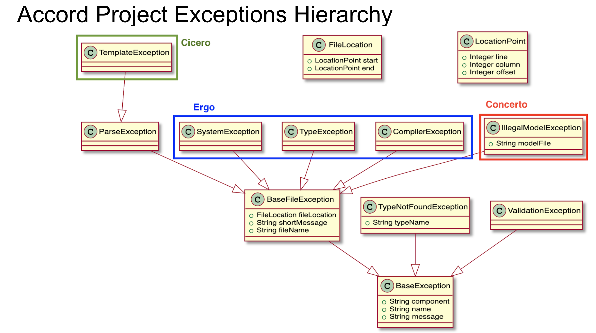

 As much as possible, errors returned by all projects (notably Cicero and the Ergo compiler) are normalized and categorized in order to facilitate handling of those error by the application code. Those errors are raised as JavaScript _exceptions_.

 ## Errors Hierarchy

 The hierarchy of errors (or exceptions) is shown on the following diagram:

 

 ## Errors Model

 For reference, those can also be described using the following Concerto model:

 ```concerto
namespace org.accordproject.errors
 /** Common */
concept LocationPoint {
  o Integer line
  o Integer column
  o Integer offset optional
}
concept FileLocation {
  o LocationPoint start
  o LocationPoint end
}
 concept BaseException {
	o String component // Node component the error originates from
  o String name      // name of the class
  o String message
}
concept BaseFileException extends BaseException {
	o FileLocation fileLocation
	o String shortMessage
	o String fileName
}
concept ParseException extends BaseFileException {
}
 /* Model errors */
concept ValidationException extends BaseException {
}
concept TypeNotFoundException extends BaseException {
	o String typeName
}
concept IllegalModelException extends BaseFileException {
	o String modelFile
}
 /* Ergo errors */
concept CompilerException extends BaseFileException {
}
concept TypeException extends BaseFileException {
}
concept SystemException extends BaseFileException {
}
 /* Cicero errors */
concept TemplateException extends ParseException {
}
```

## Common User Errors

The following are common issues encountered when working with Cicero templates and how to resolve them.

### Invalid or Missing Identifier

This occurs when your model defines an identifier field but it is not included in `data.json`.
Ensure all required fields defined in `model.cto` are provided in your JSON data file.

### Missing `data.json`

The `cicero draft` command requires a JSON data file.
If your data file has a different name, specify it using:

```bash
cicero draft --data your-file.json
```

### Namespace Mismatch

Ensure the `$class` value in your JSON matches the namespace and asset defined in `model.cto`.

Example:

```json
{
  "$class": "org.accordproject.template.MyClause"
}
```