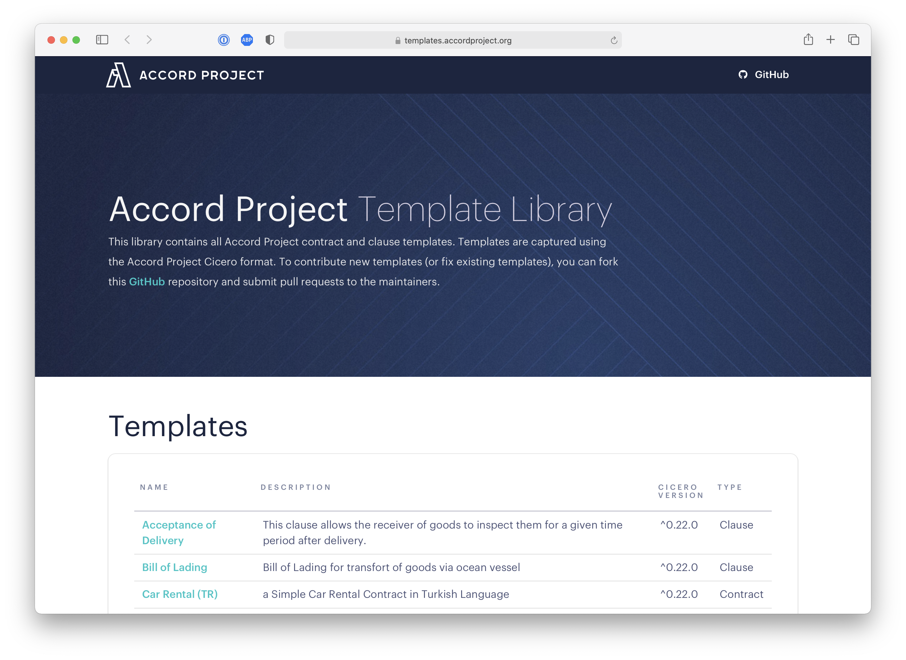
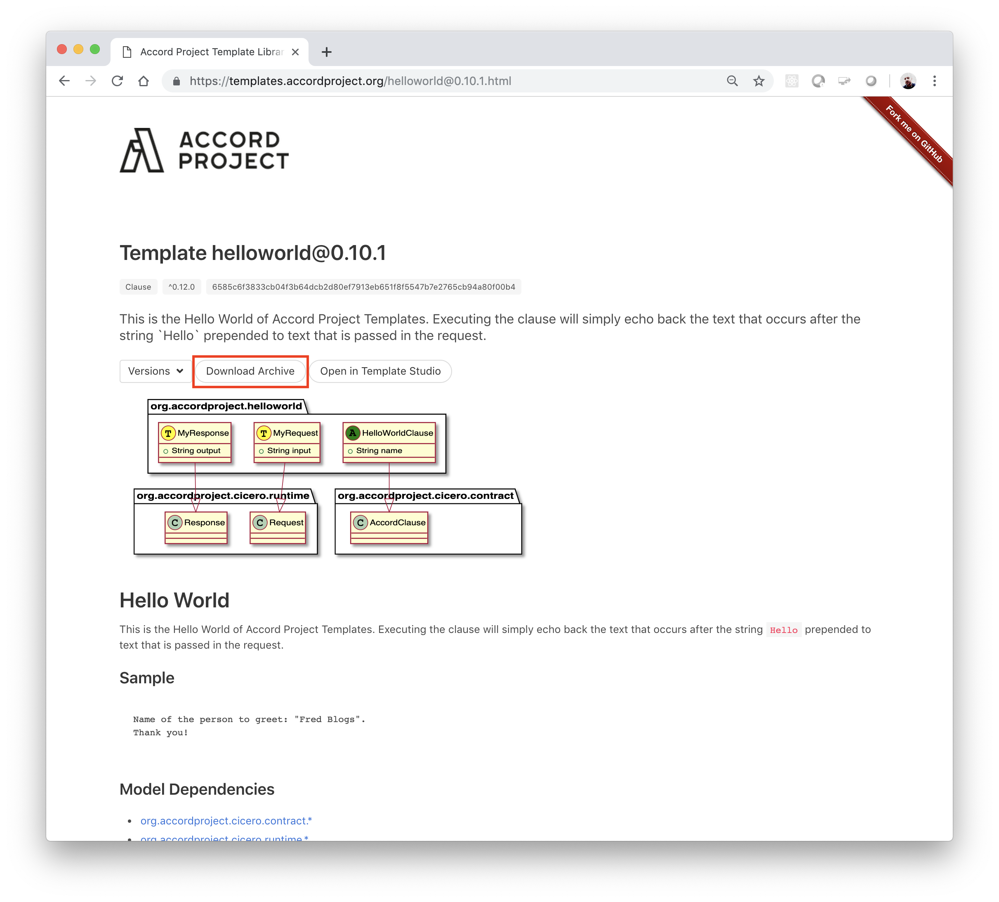

Once you have installed Cicero, you can try it on an existing Accord Project template. This explains how to download a template and use it to create contract text from data.

## Download a Template

You can download a single clause or contract template from the [Accord Project Template Library](https://templates.accordproject.org) as an archive (`.cta`) file. Cicero archives are files with a `.cta` extension, which includes all the different components for the template (text, model and logic).

If you click on the Template Library link, you should see a Web Page which looks as follows:



Scrolling down that page, you can see the index for the open-source templates along with their version, and whether they are a Clause or Contract template.

Click on the link to the `helloworld` template. You should be taken to a page which looks as follows:



Then click on the `Download Archive` button under the description for the template (highlighted in the red box in the figure). This should download the latest template archive for the `helloworld` template.

:::note
Templates are tied to a specific version of the Cicero tool. Make sure that the version number from `cicero --version` is compatible with the template. Look for `^0.26.0` or similar near the top of the template's web page.
:::

## Draft: Create Text from Data

You can use Cicero to create contract text from deal data using the `cicero draft` command. The command merges a JSON data file with the template and prints the resulting text.

### Draft from Valid Data

Using your terminal, change into the directory (or `cd` into the directory) that contains the template archive you just downloaded. Then create a `data.json` file containing:

```json
{
  "$class": "org.accordproject.helloworld@0.1.0.TemplateModel",
  "clauseId": "aa3b9db9-f25f-41f4-88a4-64baba728bfe",
  "name": "John Doe"
}
```

Then run the `cicero draft` command in your terminal:

```bash
cicero draft --template helloworld@0.15.0.cta --data data.json
```

This should create the contract text and output:

```text
Name of the person to greet: John Doe.
Thank you!
```

You can choose the output format with the `--format` option (for example `markdown` or `html`), and save the result to a file with the `--output` option:

```bash
cicero draft --template helloworld@0.15.0.cta --data data.json --output sample.md
```

### Draft from Non-Valid Data

If you attempt to draft from data which is not valid according to the template, the command returns an error.

Edit your `data.json` file so that the `name` field is missing:

```json
{
  "$class": "org.accordproject.helloworld@0.1.0.TemplateModel",
  "clauseId": "aa3b9db9-f25f-41f4-88a4-64baba728bfe"
}
```

Then run `cicero draft --template helloworld@0.15.0.cta --data data.json` again. The output should now be:

```text
error: The instance "org.accordproject.helloworld@0.1.0.TemplateModel#aa3b9db9-f25f-41f4-88a4-64baba728bfe" is missing the required field "name".
```

## Troubleshooting

For common issues when working with Cicero templates, refer to the [Errors Reference](ref-errors.md).

## What Next?

### Try Other Templates

Feel free to try the same command to draft text from other templates in the Accord Project Library. Note that for each template you can find a sample for the text and the data model on the corresponding Web page. For instance, a sample for the [Late Delivery And Penalty](https://templates.accordproject.org/latedeliveryandpenalty@0.15.0.html) clause is in the red box in the following image:


### More About Cicero

You can find more information on how to create or publish Accord Project templates in the [Work with Cicero](tutorial-templates) tutorials.

### Use on Different Platforms

Templates may be used on different platforms, not only from the command line. You can find more information on how to use Accord Project templates on different platforms (Node.js, etc.) in the [Template Execution](tutorial-nodejs) tutorials.
