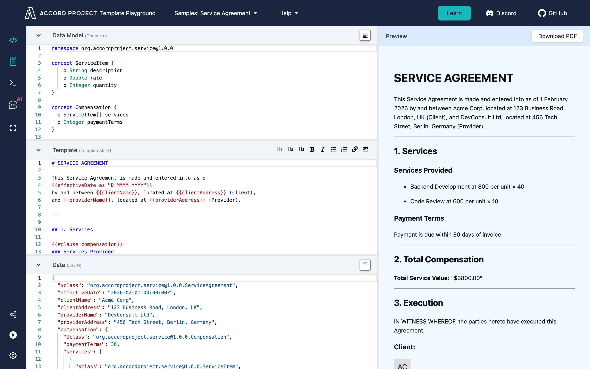
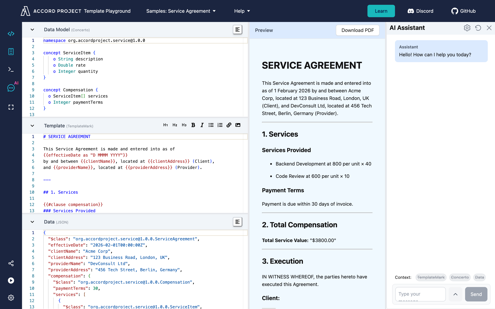

You don't need to install anything — or write any code — to start working with Accord Project. Two free, browser-based tools let you explore, edit, and test contracts and data models right away:

- **[Template Playground](https://playground.accordproject.org)** — for editing Smart Legal Contract *templates* (the text, data, and logic of an agreement).
- **[Concerto Playground](https://concerto-playground.accordproject.org)** — for designing *data models* (the structured "shape" of the information a contract uses).

Both run entirely in your web browser. This is the friendliest place to begin: no terminal, no setup.

## Template Playground: edit and test contracts

[Template Playground](https://playground.accordproject.org) is a live editor for Accord Project templates. It opens with the **Service Agreement** sample already loaded, so you can see a real contract's parts side by side and edit them with an instant preview:

- **Template** — the contract wording in [TemplateMark](markup-templatemark.md), with the variable parts (names, dates, amounts) highlighted.
- **Data Model** — the [Concerto](https://concerto.accordproject.org/docs/intro) model describing the information the contract needs, and the type of each value.
- **Data** — sample values, in JSON, used to fill the template.
- **Preview** — the finished agreement, re-rendered instantly as you edit.

Templates can also run executable **logic** (calculations and rules, written in TypeScript) — see the [Template Logic guide](logic-typescript.md).

### Try this

1. Open **[playground.accordproject.org](https://playground.accordproject.org)** — the **Service Agreement** sample loads automatically. (A short welcome tour appears the first time; click through it, or choose **Skip**.)
2. Notice the layout: the **Data Model** (Concerto), the **Template** (TemplateMark), and the sample **Data** (JSON) are stacked on the left, with a live **Preview** of the finished agreement on the right.
3. In the **Template** panel, change some of the wording — the Preview updates as you type.
4. In the **Data** panel, change a value (for example `clientName`, or a service `rate`) and watch it flow into the rendered agreement.
5. Look at the **Data Model** panel to see the typed structure the agreement requires — parties, services, and compensation.
6. Open the **AI Assistant** (the AI icon in the left toolbar) to draft or modify the template using natural language.

## Concerto Playground: design data models

Every Accord Project contract is grounded in a **data model** written in [Concerto](https://concerto.accordproject.org/docs/intro) — a simple, readable language for describing the structure of information (a party, an address, an amount, a date, and how they relate). Getting the model right is what lets both people and software work with a contract reliably.

[Concerto Playground](https://concerto-playground.accordproject.org) lets you design and explore models in your browser, with nothing to install.

With it you can:

- **Write and edit a model** and get instant feedback when something isn't valid.
- **Visualize** how the concepts in your model relate to one another.
- **Check sample data** against the model to confirm it has the right shape and values.
- **Generate code and schemas** from your model for other platforms (such as JSON Schema, TypeScript, Java, and more).

### Try this

1. Open **[concerto-playground.accordproject.org](https://concerto-playground.accordproject.org)**.
2. Start from an example model, or write a small one of your own — for example a `Person` with a `name` and an `email`.
3. Make a deliberate mistake (remove a field or mistype a value) and see how the Playground reports the problem.
4. Validate a sample piece of data against your model.
5. Generate an output format from your model to see how the same structure looks in another language.

## Explore more samples

Beyond the built-in samples, the Accord Project maintains open libraries you can browse and reuse:

- **[Template Library](https://templates.accordproject.org)** — open-source Clause and Contract templates across many legal domains (supply chain, loans, intellectual property, and more). Open any template to see its text, model, and sample data, then launch it in Template Playground.
- **[Model Repository](https://models.accordproject.org)** — open-source [Concerto](https://concerto.accordproject.org/docs/intro) data models (postal addresses, monetary amounts, time, and more) that you can import into your own models and templates.

## When you're ready for more

The Playgrounds are ideal for learning, experimenting, and prototyping. When you want to work with templates on your own machine, automate them, or build them into an application, move on to:

- **[Install Cicero](started-installation.md)** — the command-line tools for authoring, validating, and running templates locally.
- **[Hello World Template](started-hello.md)** — a first walkthrough using the command line.
- **[Concerto documentation](https://concerto.accordproject.org/docs/intro)** — the full modelling language guide.
- **[Template Authoring tutorials](tutorial-studio.md)** — deeper guides to building your own templates.

Curious how this fits into AI and agentic commerce? See the [AI & Agent Workflows](accordproject-ai.md) and [Agentic Commerce](accordproject-agentic-commerce.md) guides.
