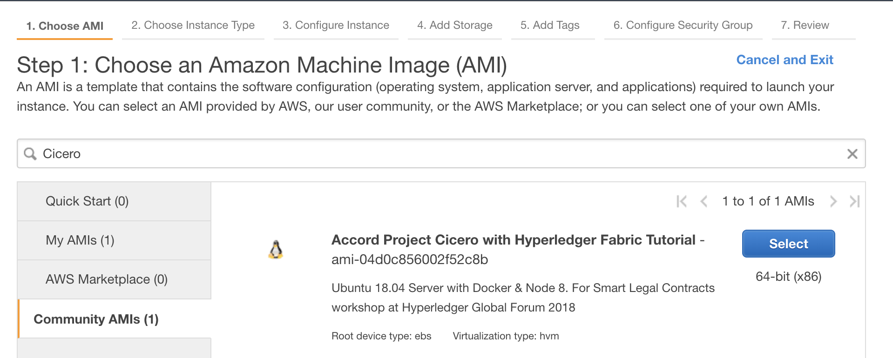
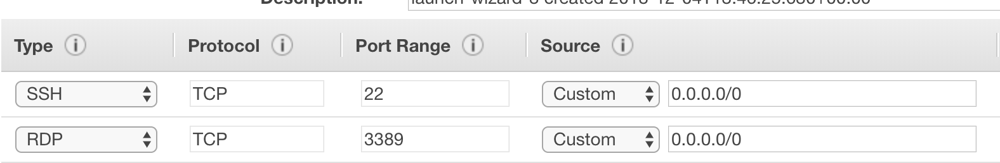
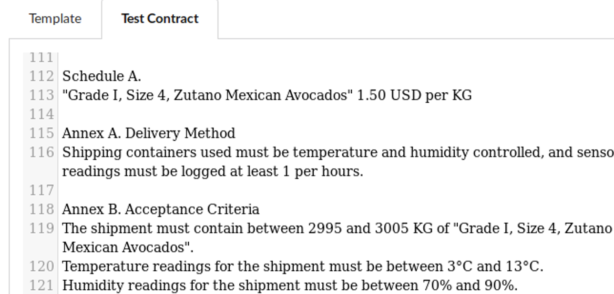
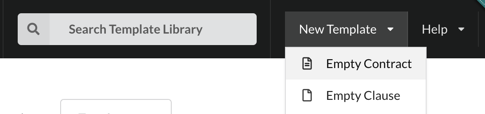

## Hyperledger Fabric 1.3

Sample chaincode for Hyperledger Fabric that shows how to execute a Cicero template:
https://github.com/clauseHQ/fabric-samples/tree/master/chaincode/cicero 

This sample shows how you can deploy and execute Smart Legal Contracts on-chain using Hyperledger Fabric v1.3.

Using this guide you can deploy a [Smart Legal Contract Template](https://templates.accordproject.org/) from the [Open Source Accord Project](https://www.accordproject.org/) to your HLF v1.3 blockchain. You can then submit transactions to the Smart Legal Contract, with the contract state persisted to the blockchain, and return values and emitted events propagated back to the client.

Before starting this tutorial, you are encouraged to review an [Introduction to the Accord Project](https://docs.google.com/presentation/d/1lYT-XlY-4UDtYR7Oc0X62nvT7AzOqYZ4QA8YVZasgy8/edit).

These instructions have been tested with:
- MacOS 10.14 / Ubuntu 18.04
- Recent release of Chrome and Safari
- Docker 18.09
- Docker Compose 1.23
- Node 8.10
- Git 2.17

If you're building a new environment yourself, we recommend using a cloud-hosted server (to save the conference WIFI!) as the installations can require large downloads.

A small number of hosted virtual machines are available from the workshop facilitators if you have trouble installing the prerequisites yourself. 

## Installing Prerequisites

### Using Amazon Web Services

If you have your own AWS account, you can use the customised Ubuntu image. From your EC2 Dashboard, create a new instance and search for **Cicero** in the Community AMIs. The AMI is available in the Frankfurt and N. Virginia regions.



The `t2.medium` instance type is sufficient for this tutorial.

You'll need also need to add an inbound rule to your Security Group to allow connections on port `3389`. This will allow you to make a remote desktop connection to your server.



The default username and password for the prebuilt image is:
- Username: `guest`
- Password: `hyperledger2018`

> Connect to your image with a Remote Desktop Client, for example, Microsoft Remote Desktop on Mac and Windows.

### Building a Custom Docker Image

If you're feeling a bit more adventurous, you can build your own system. If you don't have the tools locally on your machine, start with an [Ubuntu Bionic 18.04 image from your favourite cloud provider](https://www.ubuntu.com/download/cloud). You will need to be able to transfer files into your image, so if your server doesn't have a Desktop Manager and browser installed you'll need to find some other way to transfer files, e.g. via SCP or FTP, for example.
Once you've provisioned your server, install all of the required tools using the corresponding installation instructions:
- [Docker](https://www.digitalocean.com/community/tutorials/how-to-install-and-use-docker-on-ubuntu-18-04)
- [Node](https://www.digitalocean.com/community/tutorials/how-to-install-node-js-on-ubuntu-18-04)
- [Docker Compose](https://www.digitalocean.com/community/tutorials/how-to-install-docker-compose-on-ubuntu-18-04)
- [Git](https://www.digitalocean.com/community/tutorials/how-to-install-git-on-ubuntu-18-04)
- [Fabric](https://hyperledger-fabric.readthedocs.io/en/release-1.3/getting_started.html)

## Create your Smart Legal Contract with Template Studio

Cicero Templates are the magic glue that binds your clever legal words with the logic that will run on your network. In this first step, we'll create a template in [Template Studio](https://studio.accordproject.org/).

Template Studio is a browser-based development environment for Cicero Templates. Your templates are only every stored in your browser (and are not shared with the Accord Project), so you should **Export** your work to save it for another time.

This tutorial uses the `supplyagreement-perishable-goods` template. This Smart Legal Agreement combines a plaintext contract for the shipment of goods that impose conditions on temperature and humidity until the shipment is delivered. 

We simulate the submission of IoT events from sensors that get sent to the contract in a supply blockchain network. The contract determines the obligations and actions of the parties according to its logic and legal text.

Once you've connected to your system, open https://studio.accordproject.org in a new browser window. 

:::note
In the hosted images, Mozilla Firefox is preinstalled, click the icon on the top-left toolbar to launch it.
::: 

The Template Studio allows you to load sample templates for smart legal agreements from the [Accord Project template library](https://templates.accordproject.org/).

> In the Template Studio search bar, type **supplyagreement-perishable-goods**. Select the 0.12.1 version.

Explore the source components of the template.

- Contract Text & Grammar
- Model
- Logic
- Test Execution

Note the placeholders in the Template Grammar (found under **Contract Text** -> **Template**), and the corresponding data model definition in `contract.cto` (found under **Model**). 

The logic definition in Ergo defines the behaviour of the contract in response to Requests. The logic also reference the same contract variables, through the `contract` keyword.

You can simulate the performance of the contract using the **Text Execution** page (click **Logic** first). Clicking **Send Request** will trigger the smart clause and produce a response that indicates the total price due, along with any penalties. 

> Change some of the values in the Test Contract, for example increase the lower limit for temperature readings from 2°C to 3°C. If you reset the Test Execution and send the same request again you should notice a penalty in the response.



The _Obligations_ that are emitted by the contract are configured to be emitted as Events in Fabric. This allows any party that is involved in the contract to perform an action automatically, for example to add a payment obligation to an invoice. 

> Click **Export** to download your template

Save your CTA (Cicero Template Archive) file somewhere safe, as you'll need to use it in a later step. We suggest saving the file in user's the home folder.

> Create a `request.json` file with the contents of the **Request** box from the **Logic** -> **Test Execution** page in Template Studio. 

For example:
```json
{
    "$class": "org.accordproject.perishablegoods.ShipmentReceived",
    "unitCount": 3002,
    "shipment": {
      "$class": "org.accordproject.perishablegoods.Shipment",
      "shipmentId": "SHIP_001",
      "sensorReadings": [
        {
          "$class": "org.accordproject.perishablegoods.SensorReading",
          "centigrade": 2,
          "humidity": 80,
          "shipment": "resource:org.accordproject.perishablegoods.Shipment#SHIP_001",
          "transactionId": "a"
        }
      ]
    }
  }
```

Finally, create a `contract.txt` file with the contents of the Test Contract  box from the Contract Text page in Template Studio.

:::note
It's important that your sample contract text exactly matches your grammar's structure, this includes trailing spaces and line breaks. To be sure that you copy everything, right click the window and choose Select All, before choosing Copy.

You'll be notified if there are errors in your contract text during the next step by messages such as:
```md
Unexpected "\n"
```
:::

## Provision your Hyperledger Fabric instance

In this step, we will provision a test Hyperledger Fabric network on your machine.

:::note
If you're not using one of the prebuilt images you'll also need run the following command to download the tutorial resources from GitHub.

```sh
git clone https://github.com/clauseHQ/fabric-samples
cd fabric-samples
git checkout master
```
:::

> Open a Terminal window and type the following commands. In the hosted image there is a link start a terminal window on the desktop.
```sh
cd fabric-samples/cicero
```

Next we'll download Fabric and start the docker containers. If you're doing this for the first time, go and get a coffee. This will usually take several minutes.

> In your Terminal, type the following command to download and start Fabric.
```sh
./startFabric.sh
```

> Next install the node dependencies for the client code, with this command. This step can also take a few minutes.
```sh
npm install
```

> You can then enroll the administrator into the network, and register a user that we'll use in later scripts.
```sh
node enrollAdmin.js && node registerUser.js
```

## Deploy your contract to your network

> Using the files that you downloaded earlier, run the `deploy.js` script.

The example below assumes that all of the files are located in the same folder as `deploy.js`. 

:::note
The order of the parameters to the `deploy.js` script is important, please follow the pattern shown in the example. You'll also need to give the relative  or absolute path to the `sample.txt` file, for example if you saved the file in your home directory, replace `sample.txt` with `../../sample.txt`.
:::

```sh
node deploy.js supplyagreement-perishable-goods.cta sample.txt
```

If deployment of your contract is successful, you should see the following output:
```sh
Transaction proposal was good
Response payload: Successfully deployed contract MYCONTRACT based on supplyagreement-perishable-goods@0.9.0
Successfully sent Proposal and received ProposalResponse: Status - 200, message - ""
The transaction has been committed on peer localhost:7051
Send transaction promise and event listener promise have completed
Successfully sent transaction to the orderer.
Successfully committed the change to the ledger by the peer
```

Finally, you can trigger your Smart Legal Agreement by sending requests to it. The `submitRequest.js` script is configured to route your request to your deployed contract.

> Run the `submitRequest.js` script using your `request.json` file, by typing the following command into the terminal.
```sh
node submitRequest.js request.json 
```
If the invocation is successful, you should see the following output: 
```sh
Assigning transaction_id:  0788d105901c9f12316bb84dc1c5345be6fe96edf626d427de9871cefac4f063
Transaction proposal was good
Response payload: {"$class":"org.accordproject.perishablegoods.PriceCalculation","totalPrice":{"$class":"org.accordproject.money.MonetaryAmount","doubleValue":4503,"currencyCode":"USD"},"penalty":{"$class":"org.accordproject.money.MonetaryAmount","doubleValue":0,"currencyCode":"USD"},"late":false,"shipment":"resource:org.accordproject.perishablegoods.Shipment#SHIP_001","transactionId":"3a30f4b7-7537-4c2e-8186-49ce7e95681d","timestamp":"2018-12-01T17:49:26.100Z"}
Successfully sent Proposal and received ProposalResponse: Status - 200, message - ""
The transaction has been committed on peer localhost:7051
Send transaction promise and event listener promise have completed
Successfully sent transaction to the orderer.
Successfully committed the change to the ledger by the peer
```

Congratulations you now have a legal agreement running on your blockchain network!

Depending on the values in your request, the response payload will indicate whether a penalty is due.

Because this contract is currently stateless, i.e. it doesn't store any data on-chain, you can submit multiple requests with different values to simulate the behaviour of the contract under different circumstances. 

:::tip
Can you cause a breach due to out-of-range readings?
:::

## Extension Tasks

We gave you lots of help in the first few steps, but to learn properly, we always find that it helps to try things for yourself. Here are a few suggestions that will help you to understand what is going on better.

1. Currently, `the supplyagreement-perishable-goods` template doesn't store any data on the chain. Modify the template to store sensor readings. The readings should be looked up from the state object in your logic rather than from your request when the shipment is accepted.
:::note
Take a look at some of the other stateful Cicero Templates to see what changes you will need to make. `installment-sale` and `helloworldstate` are good examples.
If you get really stuck, a solution is available for you to [download](https://drive.google.com/file/d/1cak_P_x01w8dz43aZX8N16G5DUNp6VbG/view?usp=sharing).
:::
2. Explore the source code of the Cicero chaincode shim that transforms your requests and deployments into Fabric transactions using the Fabric Node SDK. https://github.com/clauseHQ/fabric-samples/tree/master/chaincode/cicero 
3. Create your own template from scratch using [Template Studio](https://studio.accordproject.org/), or download the [VSCode plugin](https://marketplace.visualstudio.com/items?itemName=accordproject.accordproject-vscode-plugin).

> A separate tutorial for creating a template using the Cicero CLI tool can be found in [Creating a New Template](basic-create).

4. This template also emits Obligations as Fabric events as well as returning a response to the client. Modify the Cicero chaincode to display the events do something interesting with them. How would you notify the parties that a penalty is due?

:::warning
If you would like to make changes to the cicero chaincode be aware that Docker caches the docker image for the chaincode. If you edit the source and run `./startFabric` you will _not_ see your changes.
For your code changes to take effect you need to `docker stop` the peer (use `docker ps` to get the container id) and then `docker rmi -f` your docker chaincode image. The image name should look something like `dev-peer0.org1.example.com-cicero-2.0-598263b3afa0267a29243ec2ab8d19b7d2016ac628f13641ed1822c4241c5734`
:::
5. Deploy the contract to a Fabric network that includes multiple users and nodes.

## Hyperledger Composer

A separate sample showing how to integrate Cicero with Hyperledger Composer is available here:
https://github.com/accordproject/cicero-perishable-network

