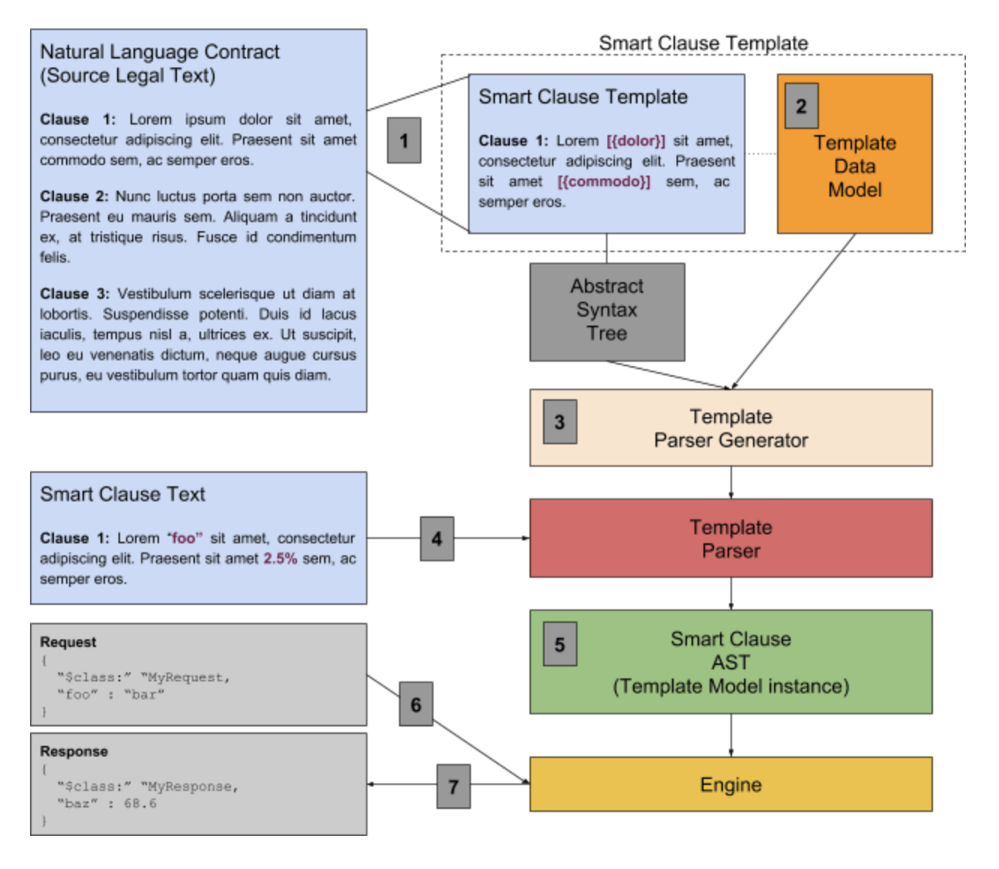
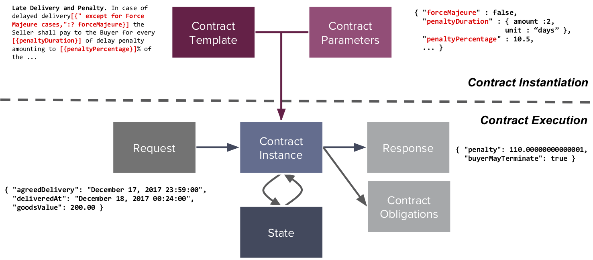

## Step 1: Creation of Clause Template
A legal professional analyzes a contract to determine the frequently used/standard clauses that are present. Clauses that are amenable to automation are extracted into a clause template. The template (more details follow) is comprised of the annotated legal text and an accompanying template data model that defines the assets, participants, concepts and events that are relevant to the clause. The business logic for the clause is coded by a developer (with review and in collaboration with the legal professional, or the suitably trained legal professional can code the contract logic themselves using the [Ergo](logic-ergo) DSL).

## Step 2: Data Modeling

Concept Template Data Model. The variables and expressions in a template are expressed in terms of a typed data model, that captures all the concepts of relevance to the clause. The data model technology allows importing concepts from namespaces, allowing concepts to be shared across templates.

## Step 3: Generation of the Template Parser
The [Cicero Open Source project](https://github.com/accordproject/cicero) contains code that can automatically generate a parser from the annotated template text (template grammar) and the associated template data model. The parser generation is completely automatic and supports customization of types and nested grammars.

## Step 4: Create a Clause
The generated template parser can now be used to dynamically edit and validate source clause text (potentially using code completion, error reporting etc). The editor technology can be embedded on a webpage, or executed as a SaaS service, or run within an IDE.

## Concept 5: Clause (instance of a Template) 
The output of the Template Parser is an instance of the Template Model (a JSON abstract syntax tree that can be deployed to the engine). It captures a machine readable (and hashable) representation of all the executable data extracted from the clause text.

## Step 6: Invoke Engine with a Request
The application feeds JSON documents to the engine that represents the request instances, which themselves have been modelled in the Template Data Model. These requests represent events of significance to the clause from the outside world.

## Step 7: Execute and Return Response
The engine invokes the business logic for the template, passing in the parameterization data, a context object and the incoming request. The engine validates the response and then returns it to the caller. The structure of the response is modelled in the Template Data Model.

Once a template has been created (Steps 1 to 4), it can be used to _instantiate_ a contract (Step 5) which itself can be executed by the template engine (Steps 5 to 6). Both contract instantiation and execution are shown in greater details on the following figure:

> Note that the Accord Project specification does not assume a specific execution environment. [Cicero](https://github.com/accordproject/cicero), which implements the Accord Project specification, includes a Node.js VM based execution engine for contracts created from Accord Project templates. The engine routes incoming requests to template functions, performs data validation, executes the functions within a sandboxed environment, and then validates the response. It can also update the contract state and emit events and/or contract obligations back to the caller.

