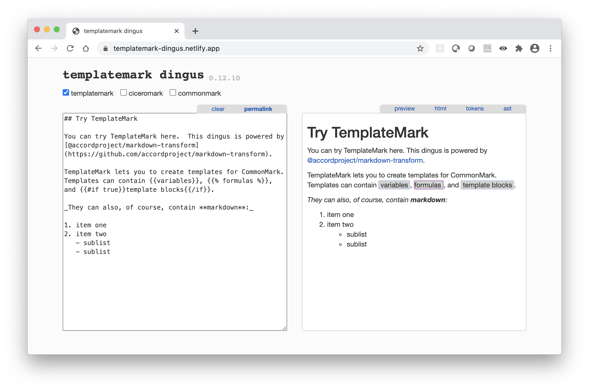
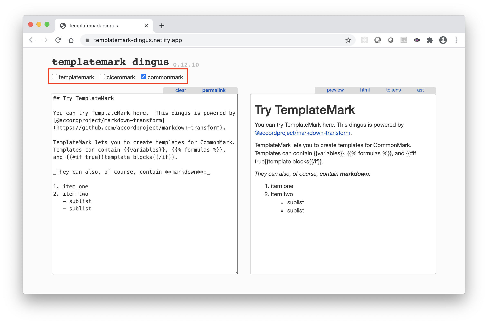
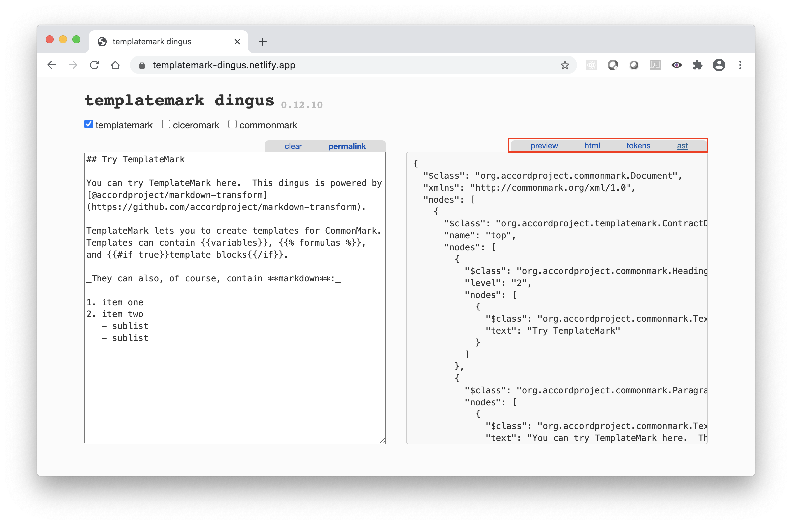

## Markdown & CommonMark

The text for Accord Project templates is written using markdown. It builds on the [CommonMark](https://commonmark.org) standard so that any CommonMark document is valid text for a template or contract.

As with other markup languages, CommonMark can express the document structure (e.g., headings, paragraphs, lists) and formatting useful for readability (e.g., italics, bold, quotations).

The main reference is the [CommonMark Specification](https://spec.commonmark.org/0.29/) but you can find an overview of CommonMark main features in the [CommonMark](markup-commonmark) Section of this guide.

## Accord Project Extensions

Accord Project uses two extensions to CommonMark: CiceroMark for the contract text, and TemplateMark for the template grammar.
 
### Lexical Conventions

Accord Project contract or template text is a string of `UTF-8` characters.

:::note
By convention, CiceroMark files have the `.md` extensions, and TemplateMark files have the `.tem.md` extension.
:::

The two sequences of characters `{{` and `}}` are reserved and used for the CiceroMark and TemplateMark extensions to CommonMark. There are three kinds of extensions:
1. Variables (written `{{variableName}}`) which may include an optional formatting (written `{{variableName as "FORMAT"}}`).
2. Formulas (written `{}`).
3. Blocks which may contain additional text or markdown. Blocks come in two flavors:
   1. Blocks corresponding to [markdown inline elements](https://spec.commonmark.org/0.29/#inlines) which may contain only other markdown inline elements (e.g., text, emphasis, links). Those have to be written on a single line as follows:
      ```
      {{#blockName variableName}} ... text or markdown ... {{/blockName}}
      ```
   2. Blocks corresponding to [markdown container elements](https://spec.commonmark.org/0.29/#container-blocks) which may contain arbitrary markdown elements (e.g., paragraphs, lists, headings). Those have to be written with each opening and closing tags on their own line as follows:
      ```
      {{#blockName variableName}}
      ... text or markdown ... 
      {{/blockBane}}
      ```

### CiceroMark

CiceroMark is used to express the natural language text for legal clauses or contracts. It uses two specific extensions to CommonMark to facilitate contract parsing:
1. Clauses within a contract can be identified using a `clause` block:
   ```
   {{#clause clauseName}}
   text of the clause
   {{/clause}}
   ```
2. The result of formulas within a contract or clause can be identified using:
   ```
   {}
   ```

For instance, the following CiceroMark for a loan between `John Smith` and `Jane Doe` includes a title (`Loan agreement`) followed by some text, followed by a fixed rate interest clause. The clause contains the terms for the loan and the result of calculating the monthly payment.
```tem
# Loan agreement

This is a loan agreement between "John Smith" and "Jane Doe", which shall be entered into
by the parties on January 21, 2021 - 3 PM, except in the event of a force majeure.

{{#clause fixedRate}}
## Fixed rate loan

This is a _fixed interest_ loan to the amount of £100,000.00
at the yearly interest rate of 2.5%
with a loan term of 15,
and monthly payments of {}
{{/clause}}
```

More information and examples can be found in the [CiceroMark](markup-ciceromark) part of this guide.

### TemplateMark

TemplateMark is used to describe families of contracts or clauses with some variable parts. It is based on CommonMark with several extensions to indicate those variables parts:
1. _Variables_: e.g., `{{loanAmount}}` indicates the amount for a loan.
2. _Template Blocks_: e.g., `{{#if forceMajeure}}, except in the event of a force majeure{{/if}}` indicates some optional text in the contract.
3. _Formulas_: e.g., `{}` calculates a monthly payment based on the `loanAmount`, `rate`, and `loanDuration` variables.

For instance, the following TemplateMark for a loan between a `borrower` and a `lender` includes a title (`Loan agreement`) followed by some text, followed by a fixed rate interest clause. This template allows for either taking force majeure into account or not, and calls into a formula to calculate the monthly payment.
```tem
# Loan agreement

This is a loan agreement between {{borrower}} and {{lender}}, which shall be entered into
by the parties on {{date as "MMMM DD, YYYY - h A"}}{{#if forceMajeure}}, except in the event of a force majeure{{/if}}.

{{#clause fixedRate}}
## Fixed rate loan

This is a _fixed interest_ loan to the amount of {{loanAmount as "K0,0.00"}}
at the yearly interest rate of {{rate}}%
with a loan term of {{loanDuration}},
and monthly payments of {}
{{/clause}}
```

More information and examples can be found in the [TemplateMark](markup-templatemark) part of this guide.

## Dingus

You can test your template or contract text using the [TemplateMark Dingus](https://templatemark-dingus.netlify.app), an online tool which lets you edit the markdown and see it rendered as HTML, or as a document object model.



You can select whether to parse your text as pure CommonMark (i.e., according to the CommonMark specification), or with the CiceroMark or TemplateMark extensions.



You can also inspect the HTML source, or the document object model (abstract syntax tree or AST).



For instance, you can open the TemplateMark from the loan example on this page by clicking [this link](https://templatemark-dingus.netlify.app/#md3=%7B%22source%22%3A%22%23%20Loan%20agreement%5Cn%5CnThis%20is%20a%20loan%20agreement%20between%20%7B%7Bborrower%7D%7D%20and%20%7B%7Blender%7D%7D%2C%20which%20shall%20be%20entered%20into%5Cnby%20the%20parties%20on%20%7B%7Bdate%20as%20%5C%22MMMMM%20DD%2C%20YYYY%20-%20hhA%5C%22%7D%7D%7B%7B%23if%20forceMajeure%7D%7D%2C%20except%20in%20the%20event%20of%20a%20force%20majeure%7B%7B%2Fif%7D%7D.%5Cn%5Cn%7B%7B%23clause%20fixedRate%7D%7D%5Cn%23%23%20Fixed%20rate%20loan%5Cn%5CnThis%20is%20a%20_fixed%20interest_%20loan%20to%20the%20amount%20of%20%7B%7BloanAmount%20as%20%5C%22K0%2C0.00%5C%22%7D%7D%5Cnat%20the%20yearly%20interest%20rate%20of%20%7B%7Brate%7D%7D%25%5Cnwith%20a%20loan%20term%20of%20%7B%7BloanDuration%7D%7D%2C%5Cnand%20monthly%20payments%20of%20%7B%7B%25%20monthlyPaymentFormula%28loanAmount%2Crate%2CloanDuration%29%20as%20%5C%22K0%2C0.00%5C%22%20%25%7D%7D%5Cn%7B%7B%2Fclause%7D%7D%5Cn%22%2C%22defaults%22%3A%7B%22templateMark%22%3Atrue%2C%22ciceroMark%22%3Afalse%2C%22html%22%3Atrue%2C%22_highlight%22%3Atrue%2C%22_strict%22%3Afalse%2C%22_view%22%3A%22html%22%7D%7D).


