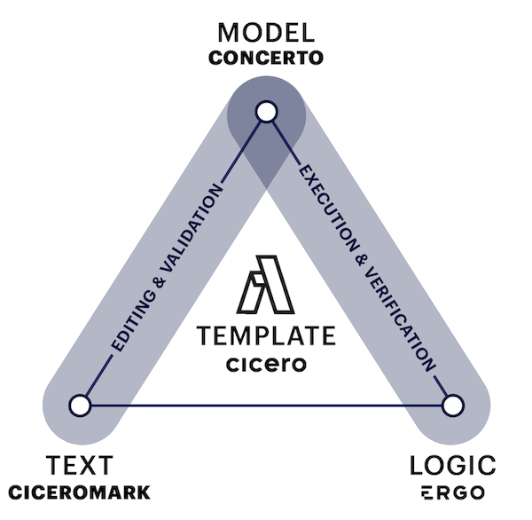
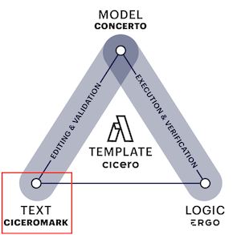

## What is a Template?

An Accord Project template ties legal text to computer code. It is composed of three elements:

- **Template Text**: the natural language of the template
- **Template Model**: the data model that backs the template, acting as a bridge between the text and the logic
- **Template Logic**: the executable business logic for the template



The three components (Text - Model - Logic) can also be intuitively understood as a **progression**, from _human-readable_ legal text to _machine-readable_ and  _machine-executable_. When combined these three elements allow templates to be edited, validated, and then executed on any computer platform (on your own machine, on a Cloud platform, on Blockchain, etc).

> We use the computing term 'executed' here, which means run by a computer. This is distinct from the legal term 'executed', which usually refers to the process of signing an agreement.

### Cicero

The implementation for the Accord Project templates is called [Cicero](https://github.com/accordproject/cicero). It defines and can read the structure of templates, with natural language bound to a data model and logic. By doing this, Cicero allows users to create, validate and execute software templates which embody all three components in the template triangle above.

_More information about how to install Cicero and get started with Accord Project templates can be found in the [Installation](started-installation) Section of this documentation._

Let's look at each component of the template triangle, starting with the text.

## Template Text



The template text is the natural language of the clause or contract. It can include markup to indicate [variables](ref-glossary#variable) for that template.

The following shows the text of an **Acceptance of Delivery** clause.

```tem
## Acceptance of Delivery.

{{shipper}} will be deemed to have completed its delivery obligations
if in {{receiver}}'s opinion, the {{deliverable}} satisfies the
Acceptance Criteria, and {{receiver}} notifies {{shipper}} in writing
that it is accepting the {{deliverable}}.

## Inspection and Notice.

{{receiver}} will have {{businessDays}} Business Days to inspect and
evaluate the {{deliverable}} on the delivery date before notifying
{{shipper}} that it is either accepting or rejecting the
{{deliverable}}.

## Acceptance Criteria.

The 'Acceptance Criteria' are the specifications the {{deliverable}}
must meet for the {{shipper}} to comply with its requirements and
obligations under this agreement, detailed in {{attachment}}, attached
to this agreement.
```

The text is written in plain English, with variables between `{{` and `}}`. Variables allows template to be used in different agreements by replacing them with different values.

For instance, the following show the same **Acceptance of Delivery** clause where the `shipper` is `"Party A"`, the `receiver` is `"Party B"`, the `deliverable` is `"Widgets"`, etc.

```md
## Acceptance of Delivery.

"Party A" will be deemed to have completed its delivery obligations
if in "Party B"'s opinion, the "Widgets" satisfies the
Acceptance Criteria, and "Party B" notifies "Party A" in writing
that it is accepting the "Widgets".

## Inspection and Notice.

"Party B" will have 10 Business Days to inspect and
evaluate the "Widgets" on the delivery date before notifying
"Party A" that it is either accepting or rejecting the
"Widgets".

## Acceptance Criteria.

The "Acceptance Criteria" are the specifications the "Widgets"
must meet for the "Party A" to comply with its requirements and
obligations under this agreement, detailed in "Attachment X", attached
to this agreement.
```

### CiceroMark

CiceroMark is the markup format in which the text for Accord Project templates is written. It defines notations (such as the `{{` and `}}` notation for variables used in the **Acceptance of Delivery** clause) which allows a computer to make sense of your templates.

It also provides the ability to specify the document structure (e.g., headings, lists), to highlight certain terms (e.g., in bold or italics), to indicate text which is optional in the agreement, and more.

_More information about the Accord Project markup can be found in the [CiceroMark](markup-cicero) Section of this documentation._

## Template Model


Unlike a standard document template (e.g., in Word or pdf), Accord Project templates associate a _model_ to the natural language text. The model acts as a bridge between the text and logic; it gives the users an overview of the components, as well as the types of different components.

The model categorizes variables (is it a number, a monetary amount, a date, a reference to a business or organization, etc.). This is crucial as it allows the computer to make sense of the information contained in the template.

The following shows the model for the **Acceptance of Delivery** clause.

```ergo
/* The template model */
asset AcceptanceOfDeliveryClause extends AccordClause {

  /* the shipper of the goods*/
  --> Organization shipper

  /* the receiver of the goods */
  --> Organization receiver

  /* what we are delivering */
  o String deliverable

  /* how long does the receiver have to inspect the goods */
  o Integer businessDays

  /* additional information */
  o String attachment
}
```

Thanks to that model, the computer knows that the `shipper` variable (`"Party A"` in the example) and the `receiver` variable (`"Party B"` in the example) are both `Organization` types. The computer also knows that variable `businessDays` (`10` in the example) is an `Integer` type; and that the variable `deliverable` (`"Widgets"` in the example) is a `String` type, and can contain any text description.

> If you are unfamiliar with the different types of variables, or want a more thorough explanation of what variables are, please refer to our [Glossary](ref-glossary#data-models) for a more detailed explanation.

### Concerto

Concerto is the language which is used to write models in Accord Project templates. Concerto offers modern modeling capabilities including support for primitive types (numbers, dates, etc), nested or optional data structures, enumerations, relationships, object-oriented style inheritance, and more.

_More information about Concerto can be found in the [Concerto Modeling](model-concerto) section of this documentation._

## Template Logic


The combination of text and model already makes templates _machine-readable_, while the logic makes it _machine-executable_.

### During Drafting

In the [Overview](accordproject) Section, we already saw how logic can be embedded in the text of the template itself to automatically calculate a monthly payment for a [fixed rate loan]():

```tem
## Fixed rate loan

This is a *fixed interest* loan to the amount of {{loanAmount}} 
at a yearly interest rate of {{rate}}%
with a loan term of {{loanDuration}}, 
and monthly payments of {}.
``` 

This uses a `monthlyPaymentFormula` function which calculates the monthly payment based on the other data points in the text:
```ergo
define function monthlyPaymentFormula(loanAmount: Double, rate: Double, loanDuration: Integer) : Double {
  let term = longToDouble(loanDuration * 12);       // Term in months
  if (rate = 0.0) then return (loanAmount / term)   // If the rate is 0
  else
    let monthlyRate = (rate / 12.0) / 100.0;        // Rate in months
    let monthlyPayment =                            // Payment calculation
      (monthlyRate * loanAmount)
      / (1.0 - ((1.0 + monthlyRate) ^ (-term)));
    return roundn(monthlyPayment, 0)                // Rounding
}
```
Each logic function has a _name_ (e.g., `monthlyPayment`), a _signature_ indicating the parameters with their types (e.g., `loanAmount:Double`), and a _body_ which performs the appropriate computation based on the parameters. The main payment calculation is here based on the [standardized calculation used in the United States](https://en.wikipedia.org/wiki/Mortgage_calculator#Monthly_payment_formula) with `*` standing for multiplication, `/` for division, and `^` for exponentiation.

### After Signature

The logic can also be used to associate behavior to the template _after_ the contract has been signed. This can be used for instance to specify what happens when a delivery is received late, to check conditions for payment, determine if there has been a breach of contract, etc.

The following shows post-signature logic for the **Acceptance of Delivery** clause.

```ergo
contract SupplyAgreement over SupplyAgreementModel {
  clause acceptanceofdelivery(request : InspectDeliverable) : InspectionResponse {

    let received = request.deliverableReceivedAt;
    enforce isBefore(received,now()) else
      throw ErgoErrorResponse{ message : "Transaction time is before the deliverable date." }
    ;

    let status =
      if isAfter(now(), addDuration(received, Duration{ amount: contract.businessDays, unit: ~org.accordproject.time.TemporalUnit.days}))
      then OUTSIDE_INSPECTION_PERIOD
      else if request.inspectionPassed
      then PASSED_TESTING
      else FAILED_TESTING
    ;
    return InspectionResponse{
      status : status,
      shipper : contract.shipper,
      receiver : contract.receiver
    }
  }
}
```

This logic describes what conditions must be met for a delivery to be accepted. It checks whether the delivery has already been made; whether the acceptance is timely, within the specified inspection date; and whether the inspection has passed or not.

### Ergo

Ergo is the programming language which is used to express contractual logic in templates. Ergo is specifically designed for legal agreements, and is intended to be accessible for those creating the corresponding prose for those computable legal contracts. Ergo expressions can also be embedded in the text for a template.

_More information about Ergo can be found in the [Ergo Logic](logic-ergo) Section of this documentation._

## What next?

Build your first smart legal contract templates, either [online](tutorial-latedelivery) with Template Studio, or by [installing Cicero](started-installation).

Explore [sample templates](started-resources) and other resources in the rest of this documentation.

If some of technical words are unfamiliar, please consult the [Glossary](ref-glossary) for more detailed explanations.

