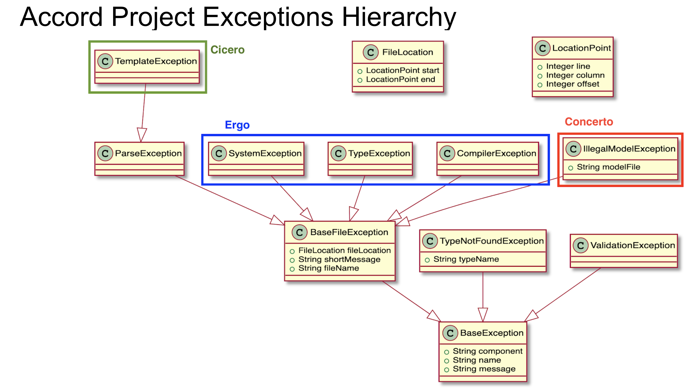

 As much as possible, errors returned by Cicero or the Ergo compiler are normalized and categorized in order to facilitate handling of those error by the application code. Those errors are raised in Cicero as JavaScript _exceptions_.

 ## Errors Hierarchy

 The hierarchy of errors (or exceptions) is shown on the following diagram:

 

 ## CTO Model

 For reference, those can also be described using the following CTO model:

 ```ergo
namespace org.accordproject.errors
 /** Common */
concept LocationPoint {
  o Integer line
  o Integer column
  o Integer offset optional
}
concept FileLocation {
  o LocationPoint start
  o LocationPoint end
}
 concept BaseException {
	o String component // Node component the error originates from
  o String name      // name of the class
  o String message
}
concept BaseFileException extends BaseException {
	o FileLocation fileLocation
	o String shortMessage
	o String fileName
}
concept ParseException extends BaseFileException {
}
 /* Model errors */
concept ValidationException extends BaseException {
}
concept TypeNotFoundException extends BaseException {
	o String typeName
}
concept IllegalModelException extends BaseFileException {
	o String modelFile
}
 /* Ergo errors */
concept CompilerException extends BaseFileException {
}
concept TypeException extends BaseFileException {
}
concept SystemException extends BaseFileException {
}
 /* Cicero errors */
concept TemplateException extends ParseException {
}
```