This tutorial will walk you through the steps of authoring a clause template in [Template Studio](https://studio.accordproject.org/).

We start with a very simple _Late Penalty and Delivery_ Clause and gradually make it more complex, adding both legal text to it and the corresponding business logic in Ergo.

## Initial Late Delivery Clause

### Load the Template

To get started, head to the `minilatedeliveryandpenalty` template in the Accord Project Template Library at [Mini Late Delivery And Penalty](https://templates.accordproject.org/minilatedeliveryandpenalty@0.4.0.html) and click the "Open In Template Studio" button.

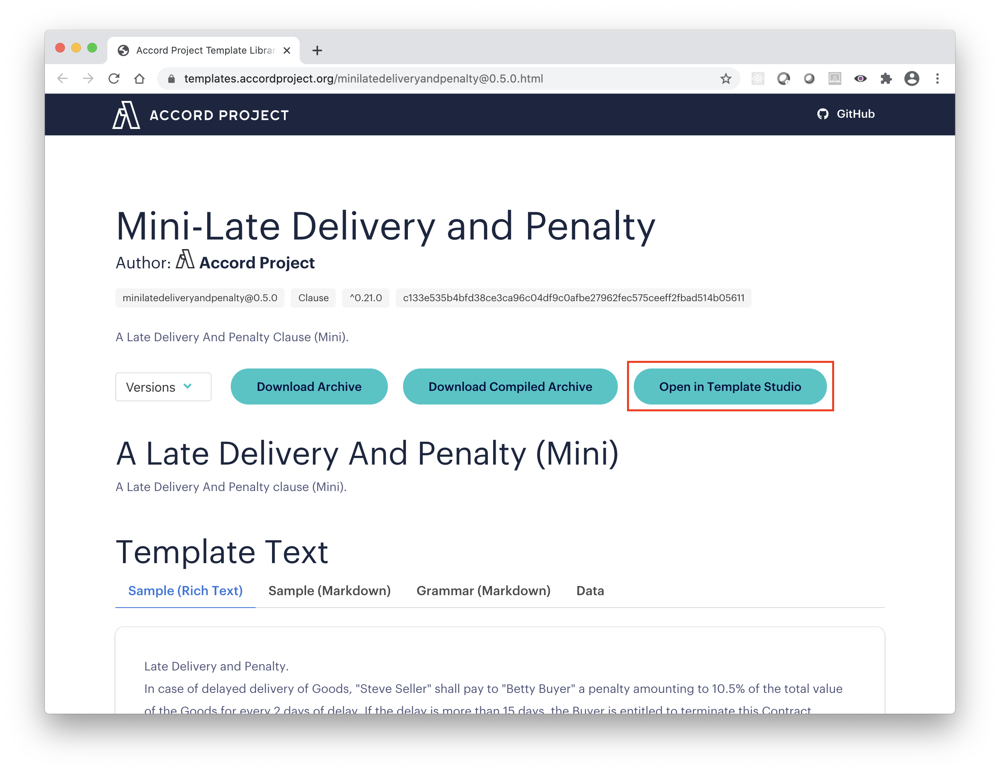

Begin by inspecting the `README` and `package.json` tabs within the `Metadata` section. Feel free to change the name of the template to one you like.

### The Contract Text

Then click on the `Text` Section on the left, which should show a `Grammar` tab, for the the natural language of the template.

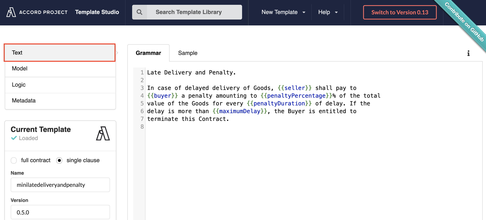

When the text in the `Grammar` tab is in sync with the text in the `Test Sample` tab, this means the sample is a valid with respect to the grammar, and data is extracted, showing in `Contract Data` tab. The contract data is represented using the JSON format and contains the value of the variables declared in the contract template. For instance, the value for the `buyer` variable is `Betty Buyer`, highlighted in red:

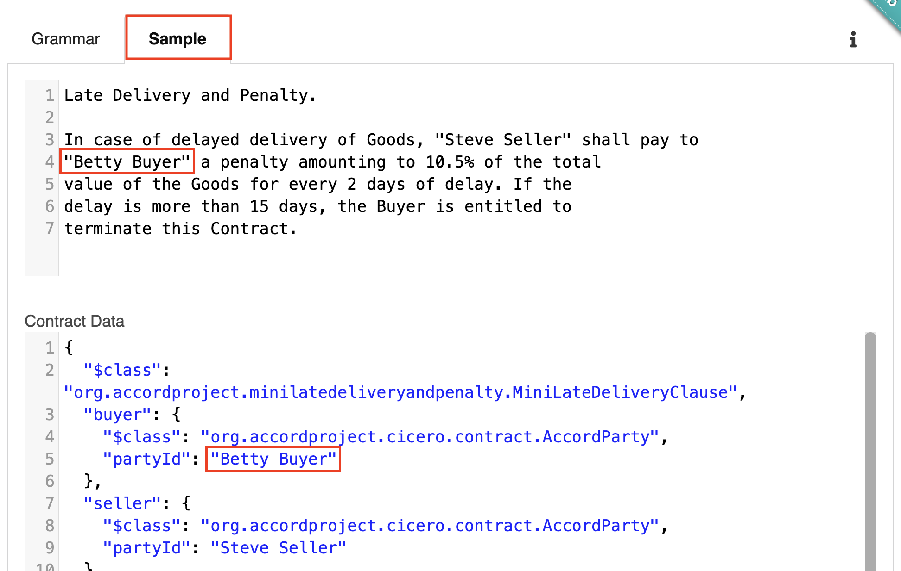

Changes to the variables in the `Test Sample` are reflected in the `Contract Data` tab in real time, and vice versa. For instance, change `Betty Buyer` to a different name in the contract text to see the `partyId` change in the contract data.

If you edit part of the text which is not a variable in the template, this results in an error when parsing the `Test Sample`. The error will be shown in red in the status bar at the bottom of the page. For instance, the following image shows the parsing error obtained when changing the word `delayed` to the word `timely` in the contract text.

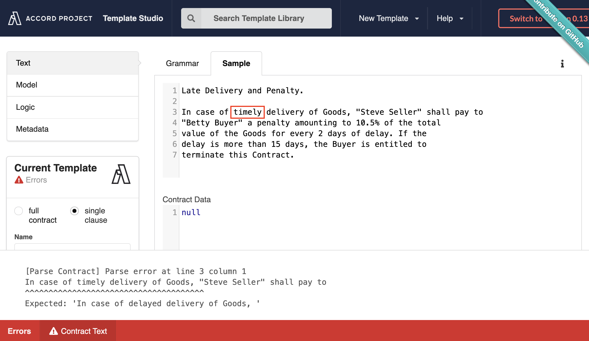

This is because the `Test Sample` relies on the `Grammar` text as a source of truth. This mechanism ensures that the actual contract always reflects the template, and remains faithful to the original legal text. You can, however, edit the `Grammar` itself to change the legal text.

Revert your changes, changing the word `timely` back to the original word `delayed` and the parsing error will disappear.

### The Model

Moving along to the `Model` section, you will find the data model for the template variables (the `MiniLateDeliveryClause` type), as well as for the requests (the `LateRequest` type) and response (the `LateResponse` type) for the late delivery and penalty clause.

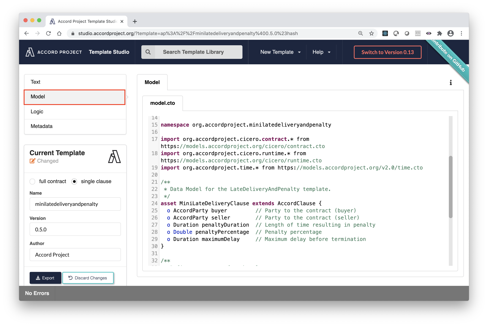

Note that a `namespace` is declared at the beginning of the file for the model, and that several existing models are being imported (using e.g., `import org.accordproject.cicero.contract.*`). Those imports are needed to access the definition for several types used in the model:
- `AccordClause` which is a generic type for all Accord Project clause templates, and is defined in the `org.accordproject.contract` namespace;
- `Request` and `Response` which are generic types for responses and requests, and are defined in the `org.accordproject.runtime` namespace;
- `Duration` which is defined in the `org.accordproject.time` namespace.

### The Logic

The final part of the template is the `Ergo` tab of the `Logic` section, which describes the business logic.

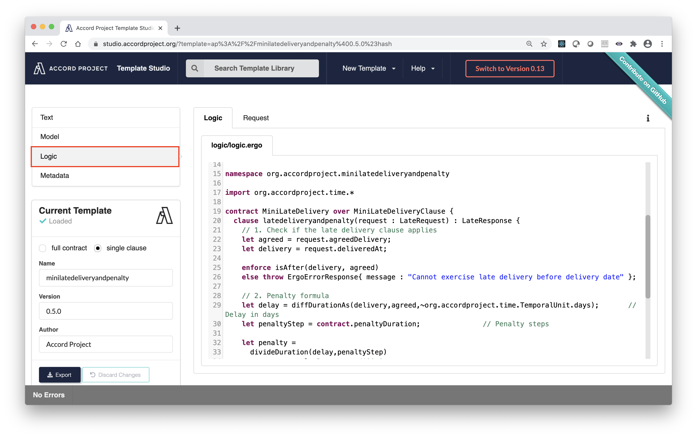

Thanks to the `namespace` at the beginning of this file, the Ergo engine can know the definition for the `MiniLateDeliveryClause`, as well as the `LateRequest`, and `LateResponse` types defined in the `Model` tab.

To test the template execution, go to the `Test Request` tab in the `Logic` section. It should be already populated with a valid `Request`. Press the `Send Request` button to trigger the clause.

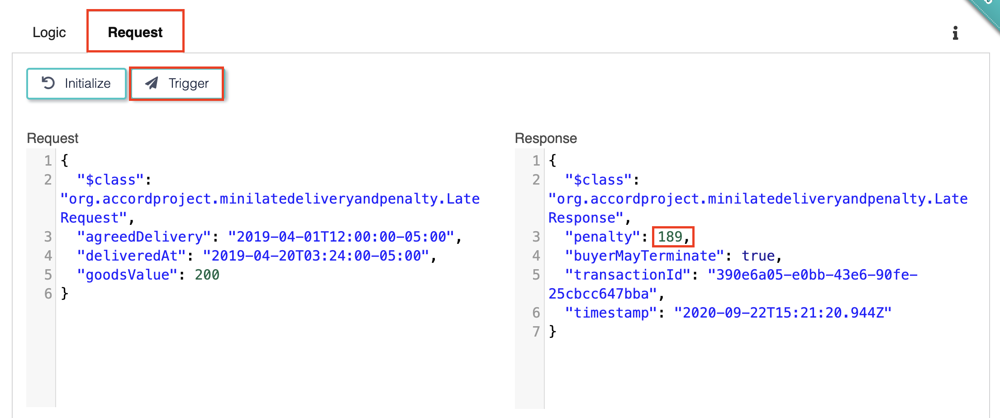

Since the value of the `deliveredAt` parameter in the request is after the value of the `agreedDelivery` parameter in the request, this should return a new response which includes the calculated penalty.

Changing the date for the `deliveredAt` parameter in the request will result in a different penalty.

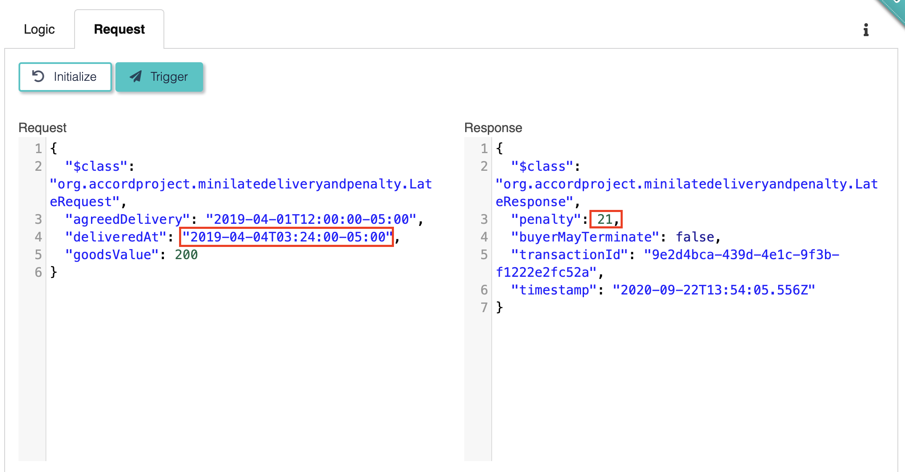

Note that the clause will return an error if it is called for a timely delivery.

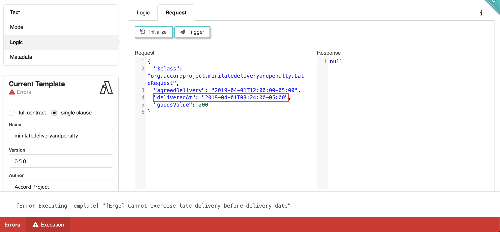

## Add a Penalty Cap

We can now start building a more advanced clause. Let us first take a moment to notice that there is no limitation to the penalty resulting from a late delivery. Under `Test Execution` in `Logic`, send this request:
```json
{
  "$class": "org.accordproject.minilatedeliveryandpenalty.LateRequest",
  "agreedDelivery": "2019-04-10T12:00:00-05:00",
  "deliveredAt": "2019-04-20T03:24:00-05:00",
  "goodsValue": 200
}
```
The penalty should be rather low. Now send this other request:
```json
{
  "$class": "org.accordproject.minilatedeliveryandpenalty.LateRequest",
  "agreedDelivery": "2005-04-01T12:00:00-05:00",
  "deliveredAt": "2019-04-20T03:24:00-05:00",
  "goodsValue": 200
}
```
Notice that the penalty is now quite a large value. It is not unusual to cap a penalty to a maximum amount. Let us now look at how to change the template to add such a cap based on a percentage of the total value of the delivered goods.

### Update the Legal Text

To implement this, we first go to the `Template` tab and add a sentence indicating: `The total amount of penalty shall not, however, exceed {{capPercentage}}% of the total value of the delayed goods.`

For convenience, you can copy-paste the new template text from here:
```tem
Late Delivery and Penalty.

In case of delayed delivery of Goods, {{seller}} shall pay to
{{buyer}} a penalty amounting to {{penaltyPercentage}}% of the total
value of the Goods for every {{penaltyDuration}} of delay. The total
amount of penalty shall not, however, exceed {{capPercentage}}% of the
total value of the delayed goods. If the delay is more than
{{maximumDelay}}, the Buyer is entitled to terminate this Contract.

```
This should immediately result in an error when parsing the contract text:


As explained in the error message, this is because the new template text uses a variable `capPercentage` which has not been declared in the model.

### Update the Model

To define this new variable, go to the `Model` tab, and change the `MiniLateDeliveryClause` type to include `o Double capPercentage`.

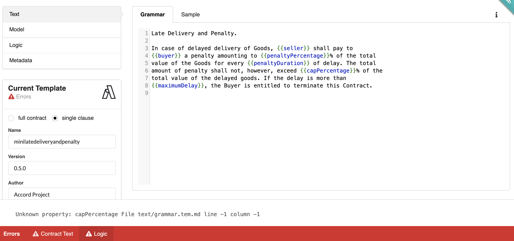

For convenience, you can copy-paste the new `MiniLateDeliveryClause` type from here:
```ergo
asset MiniLateDeliveryClause extends AccordClause {
  o AccordParty buyer         // Party to the contract (buyer)
  o AccordParty seller        // Party to the contract (seller)
  o Duration penaltyDuration  // Length of time resulting in penalty
  o Double penaltyPercentage  // Penalty percentage
  o Double capPercentage      // Maximum penalty percentage
  o Duration maximumDelay     // Maximum delay before termination
}
```

This results in a new error, this time on the test contract:

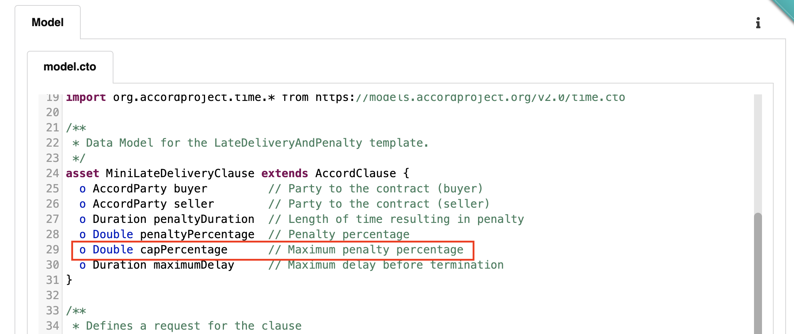

To fix it, we need to add that same line we added to the template, replacing the `capPercentage` by a value in the `Test Contract`: `The total amount of penalty shall not, however, exceed 52% of the total value of the delayed goods.`

For convenience, you can copy-paste the new test contract from here:
```md
Late Delivery and Penalty.

In case of delayed delivery of Goods, "Steve Seller" shall pay to
"Betty Buyer" a penalty amounting to 10.5% of the total
value of the Goods for every 2 days of delay. The total
amount of penalty shall not, however, exceed 52% of the
total value of the delayed goods. If the delay is more than
15 days, the Buyer is entitled to terminate this Contract.

```

Great, now the edited template should have no more errors, and the contract data should now include the value for the new `capPercentage` variable.

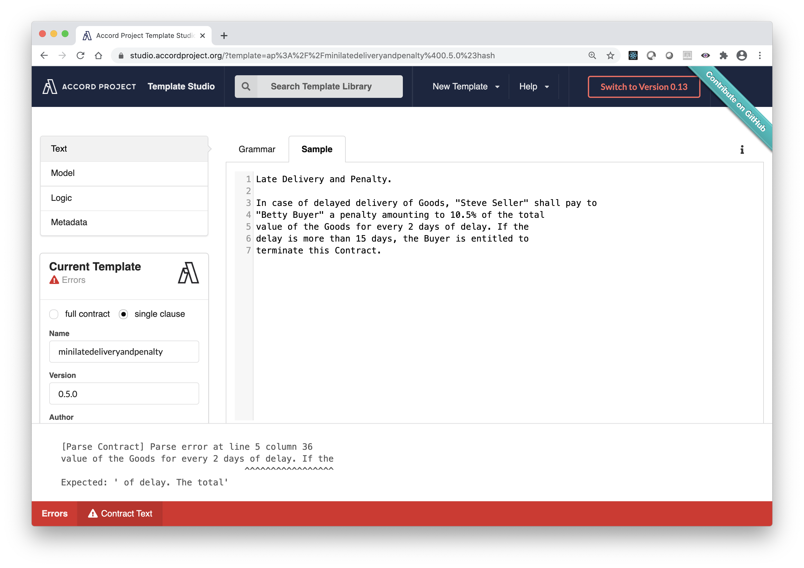

Note that the `Current Template` Tab indicates that the template has been changed.

### Update the Logic

At this point, executing the logic will still result in large penalties. This is because the logic does not take advantage of the new `capPercentage` variable. Edit the `logic.ergo` code to do so. After step `// 2. Penalty formula` in the logic, apply the penalty cap by adding some logic as follows:
```ergo
    // 3. Capped Penalty
    let cap = contract.capPercentage / 100.0 * request.goodsValue;

    let cappedPenalty =
      if penalty > cap
      then cap
      else penalty;

```
Do not forget to also change the value of the penalty in the returned `LateResponse` to use the new variable `cappedPenalty`:
```ergo
    // 5. Return the response
    return LateResponse{
      penalty: cappedPenalty,
      buyerMayTerminate: termination
    }
```
The logic should now look as follows:

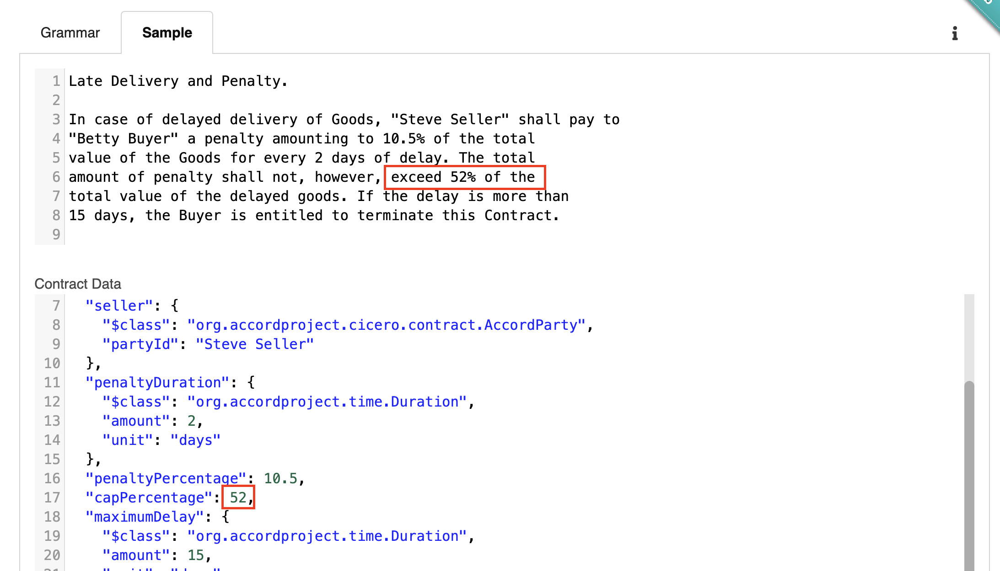

### Run the new Logic

As a final test of the new template, you should try again to run the contract with a long delay in delivery. This should now result in a much smaller penalty, which is capped to 52% of the total value of the goods, or 104 USD.

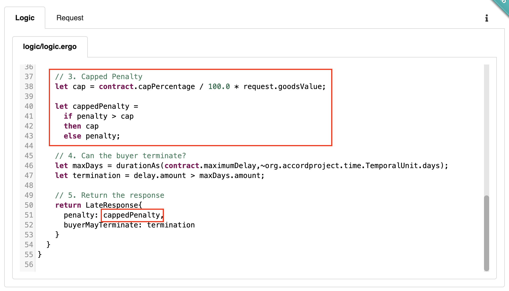

:::tip
A full version of the template after those changes have been applied can be found as the [Mini Late Delivery And Penalty Capped](https://templates.accordproject.org/minilatedeliveryandpenalty-capped@0.4.0.html) in the Template Library.
:::

## Emit a Payment Obligation.

As a final extension to this template, we can modify it to emit a Payment Obligation. This first requires us to switch from a Clause template to a Contract template.

### Switch to a Contract Template

The first place to change is in the metadata for the template. This can be done easily with the `full contract` button in the `Current Template` tab. This will immediately result in an error indicating that the model does not contain an `AccordContract` type.

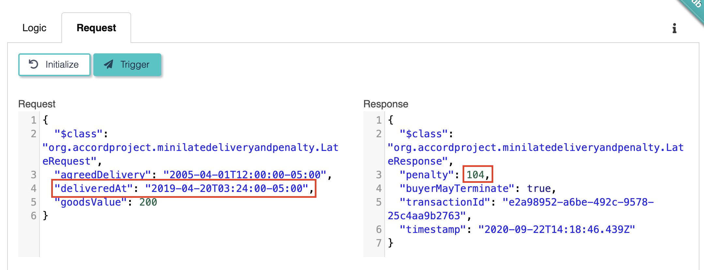

### Update the Model

To fix this, change the model to reflect that we are now editing a contract template, and change the type `AccordClause` to `AccordContract` in the type definition for the template variables:
```ergo
asset MiniLateDeliveryContract extends AccordContract {
  o AccordParty buyer         // Party to the contract (buyer)
  o AccordParty seller        // Party to the contract (seller)
  o Duration penaltyDuration  // Length of time resulting in penalty
  o Double penaltyPercentage  // Penalty percentage
  o Double capPercentage      // Maximum penalty percentage
  o Duration maximumDelay     // Maximum delay before termination
}
```

The next error is in the logic, since it still uses the old `MiniLateDeliveryClause` type which does not exist anymore.

### Update the Logic

The `Logic` error that occurs here is:
```bash
Compilation error (at file lib/logic.ergo line 19 col 31). Cannot find type with name 'MiniLateDeliveryClause'
contract MiniLateDelivery over MiniLateDeliveryClause {
                               ^^^^^^^^^^^^^^^^^^^^^^
```
Update the logic to use the the new `MiniLateDeliveryContract` type instead, as follows:
```ergo
contract MiniLateDelivery over MiniLateDeliveryContract {
```

The template should now be without errors.

### Add a Payment Obligation

Our final task is to emit a `PaymentObligation` to indicate that the buyer should pay the seller in the amount of the calculated penalty.

To do so, first import a couple of standard models: for the Cicero's [runtime model](https://models.accordproject.org/cicero/runtime.html) (which contains the definition of a `PaymentObligation`), and for the Accord Project's [money model](https://models.accordproject.org/money.html) (which contains the definition of a `MonetaryAmount`). The `import` statements at the top of your logic should look as follows:
```ergo
import org.accordproject.time.*
import org.accordproject.cicero.runtime.*
import org.accordproject.money.MonetaryAmount

```

Lastly, add a new step between steps `// 4.` and `// 5.` in the logic to emit a payment obligation in USD:
```ergo
    emit PaymentObligation{
      contract: contract,
      promisor: some(contract.seller),
      promisee: some(contract.buyer),
      deadline: none,
      amount: MonetaryAmount{ doubleValue: cappedPenalty, currencyCode: "USD" },
      description: contract.seller.partyId ++ " should pay penalty amount to " ++ contract.buyer.partyId
    };

```
That's it! You can observe in the `Test Execution` that an `Obligation` is now being emitted. Try out adjusting values and continuing to send requests and getting responses and obligations.

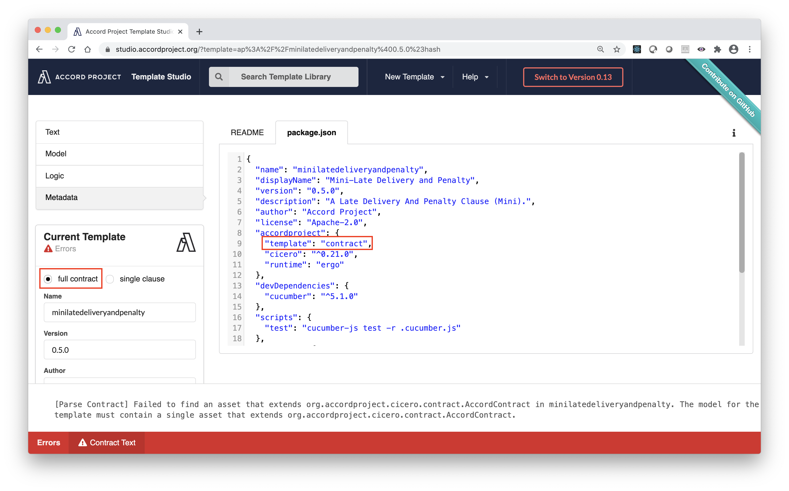
